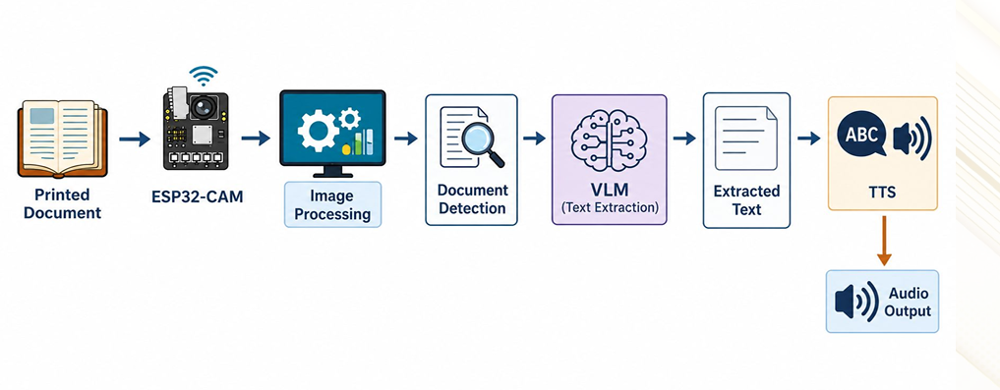
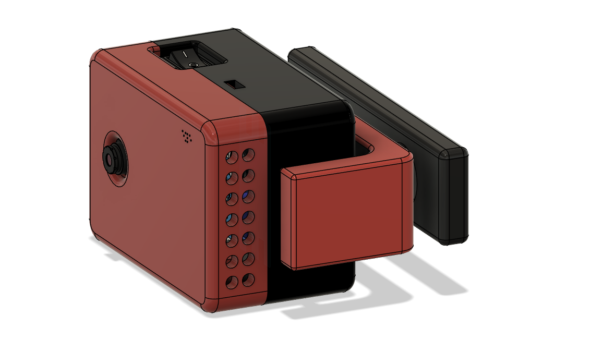
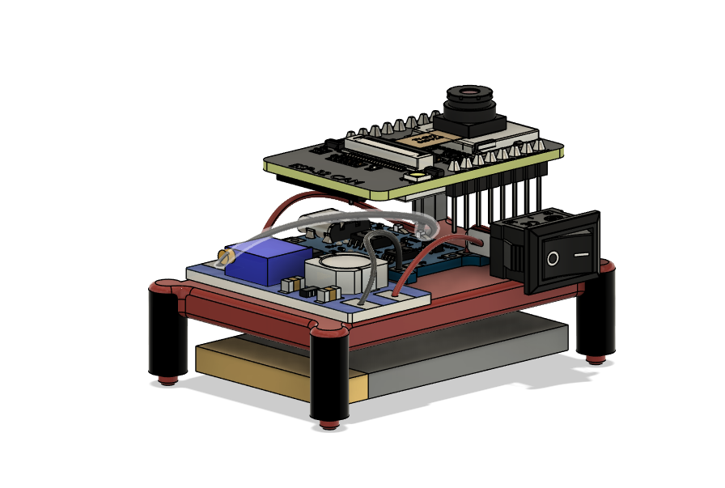
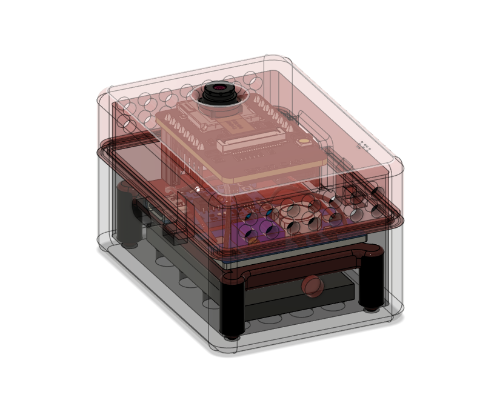

# Helping Eyes — Computer Vision-Based Document Reading System for the Visually Impaired

## Table of Contents

1. [Problem Statement](#problem-statement)
2. [Introduction](#introduction)
3. [Objectives](#objectives)
4. [System Architecture](#system-architecture)
5. [Design Approach](#design-approach)
6. [Hardware Design & 3D-Printed Module](#hardware-design--3d-printed-module)
7. [Software Pipeline](#software-pipeline)
8. [Hardware & Software Requirements](#hardware--software-requirements)
9. [Repository Structure](#repository-structure)
10. [Environment Setup](#environment-setup)
11. [Installation](#installation)
12. [Running the System](#running-the-system)
13. [Usage & Controls](#usage--controls)
14. [Performance & Evaluation](#performance--evaluation)
15. [Testing & Validation](#testing--validation)
16. [Innovations](#innovations)
17. [Future Work](#future-work)
18. [Literature Survey](#literature-survey)
19. [References](#references)
20. [Troubleshooting](#troubleshooting)

---

## Problem Statement

Visually impaired individuals face significant barriers when accessing printed materials such as books, documents, and signage. Current assistive solutions suffer from several limitations:

- **Cost:** Most commercially available reading aids are expensive and out of reach for many users.
- **Portability:** Existing devices are bulky and not designed for everyday carry.
- **Low-light performance:** Real-time document reading in poor lighting conditions remains a challenge for traditional OCR-based systems.
- **Accuracy:** Conventional OCR pipelines struggle with blurred images, complex backgrounds, and varied fonts.

Helping Eyes addresses all of these gaps by delivering an affordable, compact, autonomous, and embedded reading solution.

---

## Introduction

**Helping Eyes** is an AI-powered assistive reading device designed specifically for visually impaired users. It combines embedded hardware with state-of-the-art AI software to create a seamless, hands-free reading experience.

Core capabilities:

- Captures printed documents in real time using an **ESP32-CAM** module.
- Enhances captured frames using **OpenCV** image preprocessing techniques.
- Detects document boundaries automatically before passing the image forward.
- Extracts text intelligently using a **Vision Language Model (VLM)** — replacing conventional OCR for dramatically improved accuracy.
- Converts the extracted text to natural speech via a **Text-to-Speech (TTS)** engine and delivers it through a speaker or earphone.

The entire pipeline runs with minimal user interaction, making the device highly accessible.

---

## Objectives

- Detect printed documents automatically from a live camera feed.
- Enhance captured images using OpenCV (denoising, contrast adjustment, perspective correction).
- Integrate a Vision Language Model (VLM) for context-aware, accurate text extraction.
- Convert extracted text into clear speech output.
- Package the complete system into a compact, wearable, and embedded assistive device.

---

## System Architecture

The end-to-end pipeline follows a linear flow from image capture to audio output:



---

## Design Approach

### Hardware Design

The physical device is housed in a **custom 3D-printed module** designed specifically for this project. The enclosure was modelled in Fusion 360 and offers:

- **Portability** — lightweight enough to be worn on the chest or clipped to clothing.
- **Device protection** — fully encloses the ESP32-CAM and power electronics.
- **User comfort** — ergonomic shape that sits flush against the body.
- **Compactness & stability** — all components (camera, battery, converter, charging module) integrated into a single unit.

### Software Design

| Stage | Component | Description |
|---|---|---|
| Image Acquisition | ESP32-CAM | Captures continuous document frames over Wi-Fi HTTP stream |
| Image Processing | OpenCV | Applies denoising, sharpening, adaptive thresholding, perspective warp |
| Document Detection | Contour / YOLO heuristics | Detects and crops the printed document region |
| Text Extraction | VLM (Qwen3-VI-8B or Gemini) | Context-aware, high-accuracy text recognition from the cropped image |
| Text-to-Speech | pyttsx3 / Windows SAPI | Converts extracted text to natural speech |
| Audio Output | Speaker / 3.5 mm jack | Delivers speech to the user |

---

## Hardware Design & 3D-Printed Module

The Fusion 360 enclosure houses all electronics and is designed to be 3D-printed. Below are renders and photos of the module:

### Fusion 360 Model Renders

| View | Image |
|---|---|
| Assembled Device |  |
| Internal Circuit |  |
| Circuit Inside the Case |  |


### Assembled Device

Fully assembled and 3D printed device with ESP32-CAM mounted

 


### Component Layout

The 3D-printed module integrates:
- **ESP32-CAM** — camera and Wi-Fi SoC
- **3.7V LiPo 600mAh battery** — portable power supply
- **MT3608 Boost Converter** — steps 3.7V up to the 5V required by the ESP32-CAM
- **TP4056 Battery Charging Module** — USB-C charging for the LiPo cell

---

## Hardware & Software Requirements

### Hardware

| Component | Specification |
|---|---|
| ESP32-CAM | AI-Thinker module with OV2640 camera |
| Battery | 3.7V LiPo, 600mAh |
| Boost Converter | MT3608, output 5V |
| Charging Module | TP4056 with USB-C input |
| Speaker / Earphone | 3.5mm jack or small 8Ω speaker |

### Software

| Component | Purpose |
|---|---|
| OpenCV | Image capture, preprocessing, document detection |
| NumPy | Array and matrix operations |
| Qwen3-VI-8B (via Ollama) | Local Vision Language Model for text extraction |
| Google Gemini API | Cloud VLM alternative (via `google-generativeai`) |
| pyttsx3 / pywin32 (SAPI) | Text-to-Speech engine (Windows) |
| Ultralytics YOLOv8 | Object/document detection (uses `yolov8n.pt`) |

> **Note:** Speech output currently uses Windows SAPI. Linux/macOS users should replace the TTS backend with `espeak` or another suitable library.

---


## Environment Setup

Create a `.env` file in the project root:

```env
# IP address of the ESP32-CAM or phone IP camera
PHONE_IP=192.168.x.x

# --- For Gemini cloud reader (assitant.py) ---
API_KEY=<YOUR_GOOGLE_GENERATIVE_AI_KEY>

# --- For local Qwen via Ollama (smart_reader_qwen_detection_fix.py) ---
OLLAMA_HOST=http://localhost:11434
```

Camera stream URLs used by each script:
- `assitant.py` → `http://{PHONE_IP}:8080/video`
- `smart_reader_qwen_detection_fix.py` → `http://{PHONE_IP}:81/stream`

Adjust the URL constants inside each script if your camera app uses a different port or path.

---

## Installation

```bash
# 1. Clone the repository
git clone https://github.com/<your-org>/helping-eyes.git
cd helping-eyes

# 2. (Recommended) Create a virtual environment
python -m venv venv
source venv/bin/activate        # Linux/macOS
venv\Scripts\activate           # Windows

# 3. Install dependencies
python -m pip install -r requirment.txt

# 4. (Local Qwen only) Install and start Ollama, then pull the model
#    https://ollama.com/download
ollama pull qwen:3b-instruct    # or whichever Qwen vision model you prefer
ollama serve
```

Make sure `yolov8n.pt` is present in the project root (it is included in the repository).

---

## Running the System

### Option A — Gemini Cloud Reader (simple, requires internet + API key)

```bash
python assitant.py
```

### Option B — Local Qwen Reader (fully offline, more robust pipeline)

```bash
python smart_reader_qwen_detection_fix.py
```

---

## Usage & Controls

| Input | Action |
|---|---|
| `q` | Quit the application |
| `s` | Stop current speech output |
| `r` | Restart camera capture |
| Voice: `"stop"` / `"stop speaking"` | Stop speech (microphone must be active) |
| Voice: `"repeat"` | Repeat the last extracted text |
| Voice: `"next"` | Move to the next detected document region |

A window titled **Smart Reader** (or **Smart Reader - Qwen**) will display the live camera feed with detection overlays.

---

## Performance & Evaluation

### VLM vs. Traditional OCR (EasyOCR)

The system was benchmarked against EasyOCR on blurred real-world captures taken with the ESP32-CAM:

| Metric | EasyOCR | VLM (Qwen3-VI-8B) |
|---|---|---|
| Character Error Rate (CER) | 0.957 | **0.017** |
| Word Error Rate (WER) | 1.000 | **0.089** |
| Character Accuracy (%) | 4.28 | **98.26** |
| Word Accuracy (%) | 0.00 | **91.06** |
| Similarity (%) | 8.11 | **99.00** |

The VLM approach achieves near-perfect character accuracy (98.26%) vs. essentially 0% for EasyOCR on the same blurred images, demonstrating the decisive advantage of contextual vision-language understanding over traditional pixel-level OCR.

### Pipeline Latency

| Operation | Average Time |
|---|---|
| Frame Capture | 0.03 s |
| Document Detection | 0.10 s |
| Image Preprocessing | 0.15 s |
| VLM Processing | 10.0 s |
| Speech Generation | 1.0 s |

Total end-to-end latency is approximately **~11.3 seconds** per document read. The dominant cost is VLM inference; this can be reduced with a faster GPU, quantised models, or by switching to the Gemini cloud API.

---

## Innovations

### 1. Vision Language Models Instead of Traditional OCR
Rather than relying solely on rule-based OCR (e.g. Tesseract, EasyOCR), Helping Eyes employs a VLM (Qwen3-VI-8B) that brings contextual understanding to text recognition. This yields dramatically higher accuracy on blurred, low-contrast, and real-world camera images — as confirmed by the evaluation metrics above.

### 2. Custom 3D-Printed Assistive Module
A purpose-built enclosure was designed in Fusion 360 and 3D-printed to create a wearable, compact form factor. The housing integrates all electronics and can be worn on the chest, providing a true hands-free experience without any commercially available housing.

### 3. Autonomous Document Reading Pipeline
The system detects, enhances, extracts, and reads aloud with minimal user interaction. No button presses or menu navigation are required — the device identifies when a document is in view and begins reading automatically, making it genuinely accessible for users with no or limited vision.

---

## References

1. U. Gawande, N. Rathod, P. Bodkhe, P. Kolhe, H. Amlani and C. Thaokar, "Novel Machine Learning based Text-To-Speech Device for Visually Impaired People," *2023 2nd International Conference on Smart Technologies and Systems for Next Generation Computing (ICSTSN)*, Villupuram, India, 2023, pp. 1–5. doi: 10.1109/ICSTSN57873.2023.10151637

2. D. S R, V. K. Gowda, R. Rai R, S. Kumar S and V. K P, "Smart Reader for Blind People," *2025 International Conference in Advances in Power, Signal, and Information Technology (APSIT)*, Bhubaneswar, India, 2025, pp. 1–4. doi: 10.1109/APSIT63993.2025.11086193

3. A. Sharma, A. Srivastava, and A. Vashishth, "An Assistive Reading System for Visually Impaired using OCR and TTS," *International Journal of Computer Applications*, vol. 95, no. 2, pp. 13–18, Jun. 2014. doi: 10.5120/16566-6231

4. JaidedAI, "EasyOCR: Ready-to-use OCR with 80+ supported languages." GitHub. https://github.com/JaidedAI/EasyOCR

---

## Troubleshooting

| Issue | Solution |
|---|---|
| Cannot connect to camera stream | Verify `PHONE_IP` in `.env`. Confirm the camera app / ESP32 is streaming at the URL printed on startup. |
| Ollama / Qwen errors | Ensure `ollama serve` is running and the model is pulled: `ollama pull qwen:3b-instruct` |
| Google Gemini API failures | Check `API_KEY` in `.env` and network connectivity. |
| No speech output | Confirm Windows SAPI is installed. On Linux/macOS, replace the TTS backend with `espeak` or `pyttsx3` with a compatible driver. |
| `yolov8n.pt` not found | The weights file must be present in the project root. Download from [Ultralytics](https://github.com/ultralytics/assets/releases) if missing. |
| Very slow VLM inference | Use a GPU if available. Alternatively switch to the Gemini cloud API for faster response times. |
